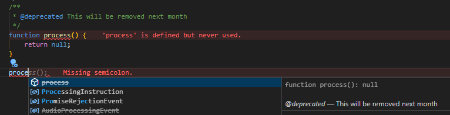

# Mark methods as depracated properly

When method should be depracated, use JSDoc params to mark it as depracated with some description

```js
/**
 * @deprecated This will be removed next month
 */
function process() {
	return null;
}
```

Then when someone tries to use this method, it will be strikethrough in autocomplete popup. See VsCode example below.


