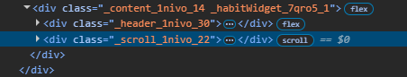
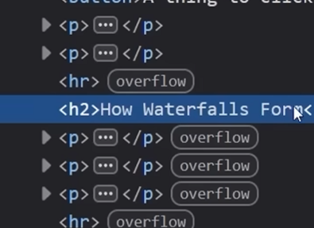

# Finding overflow issues

`scroll` flag next to element in Element tab helps to find which elements are scrollable.

Also Firefox has `overflow` flag which determines which element is falling outside of a visible area of webpage.

