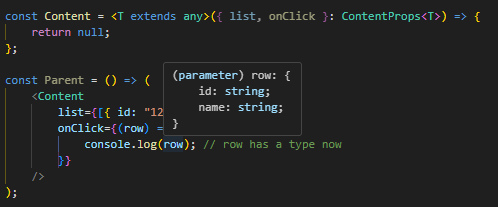

# Generic component props
```ts
type ContentProps<T> = {
	list: T[];
	onClick: (row: T) => void;
};

const Content = <T extends any>({ list, onClick }: ContentProps<T>) => {
	return null;
};

const Parent = () => (
	<Content
		list={[{ id: "123", name: "Joh" }]}
		onClick={(row) => {
			console.log(row); // row has a type now
		}}
	/>
);
```

With generic types, we can use autocomplete inside **onClick** function.


