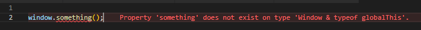
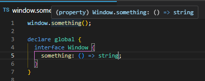

# Declare types for globals

By default custom properties are not allowed for global variables like window.



With use of TypeScript we could extends Windows interface to add additional properties.


```ts
declare global {
  interface Window {
    something: () => void;
  }
}
```

Then after this change, method is available in global scope.


